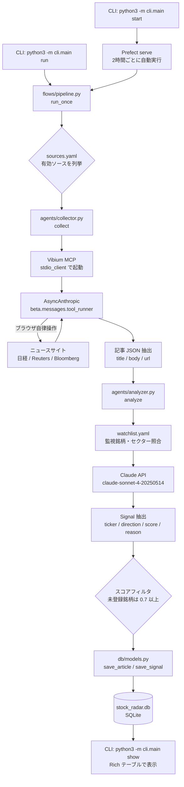

# stock-radar

ニュース・SNSを自動巡回し、株価上昇に影響しそうな銘柄をユーザーに通知する投資判断パートナーツール。

Claude API でブラウザ操作エージェントと分析エージェントを動かし、収集したシグナルを SQLite に保存して CLI で確認できる。Prefect による定期スケジューリングにも対応している。

---

## 目次

- [アーキテクチャ](#アーキテクチャ)
- [ディレクトリ構成](#ディレクトリ構成)
- [技術スタック](#技術スタック)
- [セットアップ手順](#セットアップ手順)
- [CLIコマンド](#cliコマンド)
- [設定ファイル](#設定ファイル)
- [主要ロジック](#主要ロジック)
- [データベーススキーマ](#データベーススキーマ)

---

## アーキテクチャ



---

## ディレクトリ構成

```
stock-radar/
├── .env                        # APIキー等（コミット禁止）
├── .gitignore
├── requirements.txt
├── CLAUDE.md
├── config/
│   ├── sources.yaml            # 巡回サイト設定
│   └── watchlist.yaml          # 監視セクター・ティッカー
├── agents/
│   ├── __init__.py
│   ├── collector.py            # 収集エージェント（Vibium MCP + AsyncAnthropic）
│   └── analyzer.py             # 分析エージェント（Claude API でティッカー抽出・スコアリング）
├── flows/
│   ├── __init__.py
│   └── pipeline.py             # Prefect フロー定義
├── db/
│   ├── __init__.py
│   ├── models.py               # SQLite スキーマ・CRUD
│   └── stock_radar.db          # SQLiteデータベース（自動生成）
├── cli/
│   ├── __init__.py
│   └── main.py                 # CLIエントリーポイント（Rich 使用）
└── screenshots/                # Vibium スクリーンショット保存先
```

---

## 技術スタック

| 用途 | ライブラリ / ツール |
|------|-------------------|
| ブラウザ操作 | Vibium MCP (`npx -y vibium mcp`) |
| エージェント制御 | Claude API `claude-sonnet-4-20250514` |
| MCP クライアント | `mcp.client.stdio.stdio_client` + `anthropic.lib.tools.mcp.async_mcp_tool` |
| 非同期実行 | `AsyncAnthropic` + `beta.messages.tool_runner` |
| スケジューリング | Prefect 3.x (`Interval` スケジュール、`serve()` で起動) |
| インターフェース | Rich ライブラリ（CLI） |
| データベース | SQLite (`sqlite-utils`) |
| 設定管理 | PyYAML |
| 環境変数 | python-dotenv |
| Python | 3.14.x (`python3` コマンド) |
| Node.js | v24.x (`npx` 経由で Vibium を実行) |

---

## セットアップ手順

### 前提条件

- Python 3.12 以上（プロジェクトでは 3.14.x を使用）
- Node.js（`npx` コマンドが使えること）
- `ANTHROPIC_API_KEY` が取得済みであること

### 1. 仮想環境の作成と依存パッケージのインストール

```bash
cd /Users/yoshiakigoto/work/stock-radar

python3 -m venv .venv
source .venv/bin/activate

pip install -r requirements.txt
```

### 2. 環境変数の設定

`.env` ファイルをプロジェクトルートに作成する（このファイルはコミット禁止）。

```
ANTHROPIC_API_KEY=sk-ant-xxxxxx
```

### 3. DB の初期化確認

```bash
python3 -c "from db.models import init_db; init_db(); print('DB OK')"
```

`db/stock_radar.db` が自動生成され、`articles` テーブルと `signals` テーブルが作られる。

### 4. 動作確認

```bash
# 収集・分析を1回実行（全ソース）
python3 -m cli.main run

# 結果を表示
python3 -m cli.main show
```

---

## CLIコマンド

```bash
# 最新シグナルを表示（デフォルト: 上位10件）
python3 -m cli.main show

# 特定ティッカーで絞り込み
python3 -m cli.main show --ticker 7203

# 表示件数を指定
python3 -m cli.main show --limit 20

# 今すぐ全ソースの収集・分析を実行
python3 -m cli.main run

# 特定サイトだけ実行
python3 -m cli.main run --source 日経電子版

# watchlist に銘柄を追加
python3 -m cli.main watch add --ticker 6367 --name ダイキン工業

# Prefect スケジューラを起動（2時間ごとに自動実行）
python3 -m cli.main start
```

### 出力例（`show` コマンド）

```
╭────────────────────────────────────────────────╮
│ Stock Radar — 最新シグナル                     │
│ 2026-05-31 09:00 JST                           │
╰────────────────────────────────────────────────╯

 ティッカー    企業名 / 根拠                       方向     スコア  ソース         日時
 ─────────────────────────────────────────────────────────────────────────────────────
 7203 (JP)    北米販売台数が前年比15%増と発表…      ↑UP      0.85   日経電子版     2026-05-31 08:45
 NVDA (US)    次世代GPU発表、データセンター向け…    ↑UP      0.91   Reuters Japan  2026-05-31 08:46
 8306 (JP)    日銀追加利上げ観測で収益拡大…        ↑UP      0.72   Bloomberg      2026-05-31 08:47
```

---

## 設定ファイル

### `config/sources.yaml` — 巡回サイト設定

収集対象のニュースサイトを定義する。`enabled: false` にするとスキップされる。

```yaml
sources:
  - name: 日経電子版
    url: https://www.nikkei.com/markets/
    language: ja
    enabled: true
    priority: 1

  - name: Reuters Japan
    url: https://jp.reuters.com/markets/
    language: ja
    enabled: true
    priority: 2

  - name: Bloomberg Japan
    url: https://www.bloomberg.co.jp/markets
    language: ja
    enabled: true
    priority: 3
```

新しいサイトを追加する場合は、このファイルにエントリを追記するだけでよい。

### `config/watchlist.yaml` — 監視銘柄・セクター設定

優先的に監視したい銘柄とセクターを定義する。登録銘柄のシグナルはスコアが +0.1 される。未登録銘柄はスコア 0.7 未満の場合は結果から除外される。

```yaml
sectors:
  - 半導体
  - エネルギー
  - 金融
  - 自動車

tickers:
  - code: "7203"
    name: トヨタ自動車
  - code: "6758"
    name: ソニーグループ
  - code: "8306"
    name: 三菱UFJ

us_tickers:
  - code: NVDA
    name: NVIDIA
  - code: TSM
    name: TSMC
```

`python3 -m cli.main watch add` コマンドでも `tickers` セクションに追記できる。

---

## 主要ロジック

### 収集エージェント (`agents/collector.py`)

1. `mcp.client.stdio.stdio_client` で `npx -y vibium mcp` をサブプロセスとして起動し、MCP セッションを確立する
2. `anthropic.lib.tools.mcp.async_mcp_tool` で MCP ツール一覧を Anthropic ツール形式に変換する
3. `AsyncAnthropic().beta.messages.tool_runner` を使い、`claude-sonnet-4-20250514` がブラウザを自律的に操作して記事を収集する（スクロール、ペイウォール対応含む）
4. レスポンスの最終メッセージの `text` ブロックから JSON を抽出し、`articles` リストを返却する
5. エラーは `CollectorResult.error` に記録し、上位層に例外を伝搬させない

スクリーンショットは `screenshots/` ディレクトリに自動保存される。

### 分析エージェント (`agents/analyzer.py`)

1. `watchlist.yaml` を読み込み、監視銘柄・セクターの一覧をシステムプロンプトに付加する
2. 収集した記事を1件ずつ `claude-sonnet-4-20250514` に送信し、株価影響銘柄を JSON 形式で返させる
3. `watchlist.yaml` 登録銘柄は Claude 側でスコアが +0.1 される（プロンプトで明示的に指示）
4. 未登録銘柄はスコア 0.7 未満をフィルタして除外する
5. `direction: UP / DOWN / NEUTRAL`、`score: 0.0〜1.0` の `Signal` データクラスを返す

### パイプライン (`flows/pipeline.py`)

- `run_once(source_name)`: CLI の `run` コマンドから呼ばれる手動実行関数。各ソース間に 3 秒の sleep を挿入してレート制限に対応する
- `stock_radar_flow`: Prefect フロー。`collect_from_source`（リトライ1回）→ `analyze_articles` → `save_to_db` の順で Prefect タスクとして実行する
- `cli start` コマンドから `stock_radar_flow.serve()` を呼び出すと、Prefect が 2 時間ごとにフローを自動実行する

### DB (`db/models.py`)

- `init_db()`: `articles` テーブルと `signals` テーブルを作成する（冪等）
- `save_article()`: URL をユニークキーとして `INSERT OR IGNORE` で保存する
- `save_signal()`: `article_id` を外部キーとしてシグナルを保存する
- `get_latest_signals()`: `signals` と `articles` を JOIN して最新順・スコア降順で取得する（ticker フィルタ対応）
- DB の保存はトランザクション（`with db.conn:`）で保護されている

---

## データベーススキーマ

### articles テーブル

| カラム | 型 | 説明 |
|--------|----|------|
| id | INTEGER PK | 自動採番 |
| source | TEXT | サイト名（例: 日経電子版） |
| url | TEXT UNIQUE | 記事 URL（重複排除キー） |
| title | TEXT | 記事タイトル |
| body | TEXT | 記事本文または要約 |
| collected_at | TEXT | 収集日時（ISO 8601） |
| lang | TEXT | 言語コード（ja / en） |

### signals テーブル

| カラム | 型 | 説明 |
|--------|----|------|
| id | INTEGER PK | 自動採番 |
| article_id | INTEGER FK | articles.id への外部キー |
| ticker | TEXT | 銘柄コード（例: 7203、NVDA） |
| market | TEXT | 市場区分（JP / US） |
| direction | TEXT | 方向性（UP / DOWN / NEUTRAL） |
| score | REAL | 影響スコア（0.0〜1.0） |
| reason | TEXT | Claude による根拠テキスト |
| analyzed_at | TEXT | 分析日時（ISO 8601） |

インデックス: `articles.url`（UNIQUE）、`signals.ticker`、`signals.analyzed_at`

---

## 注意事項

- `.env` ファイルは絶対にコミットしないこと
- `python` コマンドではなく `python3` を使うこと
- 実行前に必ず仮想環境を有効化すること（`source .venv/bin/activate`）
- 同一サイトへの連続アクセスを避けるため、ソース間に 3 秒の sleep が入っている
- Vibium MCP は初回実行時に `npx` が自動ダウンロードするため、インターネット接続が必要
